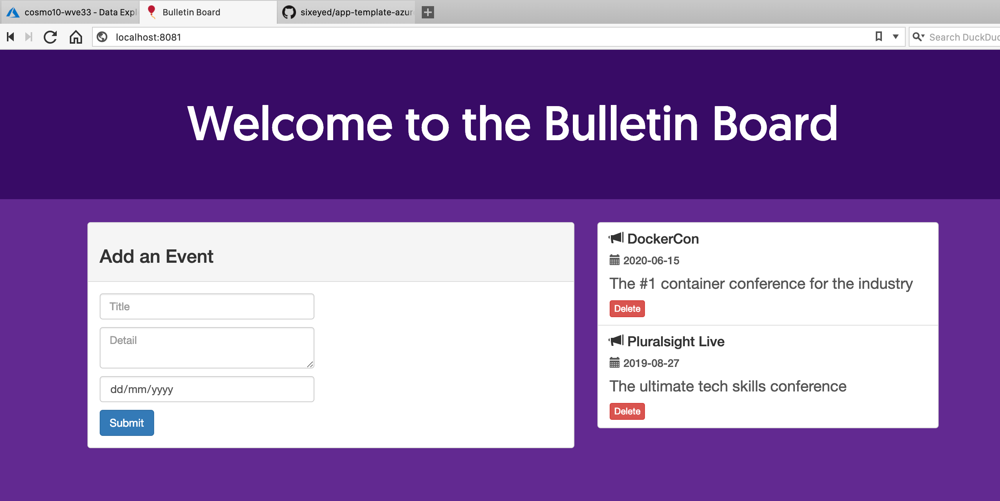

# Bulletin Board Demo App

Welcome to the Bulletin Board sample! It's a simple NodeJS application which uses Vue for the front end, Express for the backend, and MongoDB for storage.

This source code was scaffolded by a [Docker Application Template](https://github.com/sixeyed/app-template-aks-cosmosdb), together with an application manifest to deploy the app: [docker-compose.yaml](../docker-compose.yaml).

> The output also includes GitHub actions for creating a Kubernetes cluster and a CosmosDB database in Azure, and for deploying your demo app to the cluster.

## Push this repo to create your Kubernetes cluster & Azure database

Your GitHub repo should have been set up in advance by your admins. 

Open a terminal for this folder and set up the GitHub remote:

```
git init
git add --all
git commit -m "A template built all this!"
git remote add origin {{range .Services}}{{if eq "github" .ID}}https://github.com/{{.Parameters.username}}/{{.Parameters.repoName}}.git{{end}}{{end}}
```

Push the code to GitHub. This will start an action to create your Azure resources:

```
git push -u origin master
```

The actions uses secrets from your repo to connect to Azure. Then it:

- creates an AKS cluster 
- deploys [Helm](https://helm.sh) on the cluster
- deploys [Compose on Kubernetes](https://github.com/docker/compose-on-kubernetes) on the cluster
- creates a CosmosDB account configured to use the Mongo API

## Meanwhile... run the app locally

Docker Application Designer uses the [docker-compose.yaml](../docker-compose.yaml) manifest to run the app locally.

Click _Start_ in Application Designer in the app isn't already running. Then browse to:

- http://localhost:{{.Parameters.externalPort}}

You should see something like this:



The app lists upcoming conferences, which it creates as seed data. Each conference in the list is stored as a document in Mongo. You can add or delete entries.

## Check the Code

The database connection uses the standard NodeJS MongoDB connector. All operations use async await semantics. You can see how to connect to MongoDB and then list, create and delete documents in the code - the exact same code works with MongoDB in a local container and with CosmosDB in Azure.

- [backend/eventData.js](./backend/eventData.js)

The UI is a simple Vue app:

- the homepage is in [index.html](./index.html)
- the Vue front end is in [app.js](./app.js) 
- the Node back end is in [server.js](./server.js)

You can edit those files and click _Restart_ in Application Designer to update your app.

## Deploy to Kubernetes

Your AKS cluster has been provisioned with [Compose on Kubernetes](https://github.com/docker/compose-on-kubernetes), so you can use **the exact same** Docker Compose format to deploy to AKS.

And your GitHub repo has another Action which deployw your app using the generated [docker-compose.production.yaml](../docker-compose.production.yaml) file when you push changes.

Now that you've edited the UI, push your changes to deploy the app to AKS:

```
git add --all
git commit -m 'I edited this myself'
git push origin master
```

## Browse to the app on AKS

Your app is running now and you can browse to the Kubernetes dashboard on AKS to see the deployment.

Launch an [Azure Cloud Shell](https://shell.azure.com) session, then run the AKS dashboard:

```
az aks browse --resource-group {{range .Services}}{{if eq "azure" .ID}}{{.Parameters.resourceGroup}}{{end}}{{end}} --name {{range .Services}}{{if eq "aks" .ID}}{{.Parameters.clusterName}}{{end}}{{end}}
```

From here you can see:

- the deployment generated from the Docker Compose file
- the secret containing the CosmosDB connection string
- the pod running the demo app
- the service with an external endpoint to access the app

You can make changes to the code locally, push to GitHub your changes will be deployed to AKS.


### Credits

This is the original [Bulletin Board sample app](https://github.com/chenkie/vue-events-bulletin).